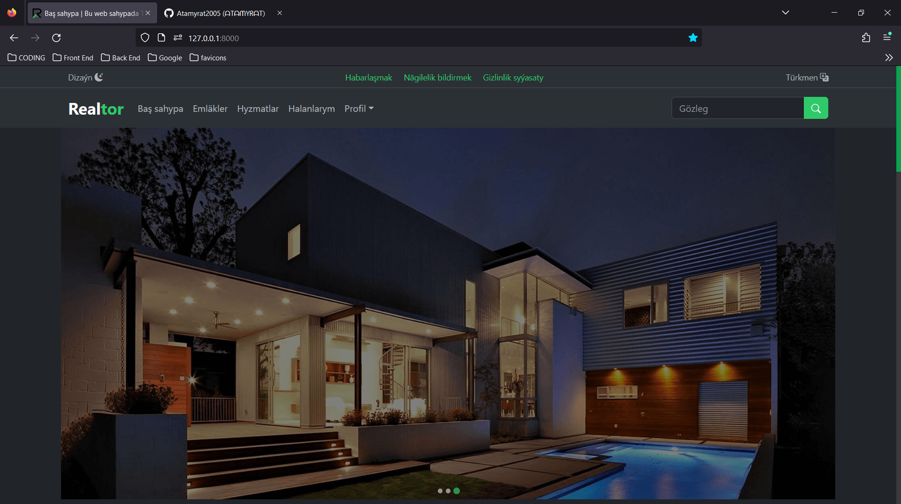

<div align="center">

Estate-agency powered by Atamyrat
======
  This Estate agency website backend is built in php and Laravel. This website can be searched using filters. And website has dynamic admin panel that can add, edit and delete estate and read the sended messages of users. **Estate-agency PRO** version is private if you want see or know about utilities of the website you can contact with me or chekout websites navbar has pro link there are have wideo of **Estate-agency PRO** or scroll down and look screenshots of pro website.
  
### Languages and Tools


 


 


Requirements
------
1. PHP min v.8
2. DB server (Recommended:MySQL or PgSQL)
3. [composer min v.2](https://getcomposer.org/)
4. Please check other requirements of  [Laravel](https://laravel.com/)

Setup Directions
------
1. ```composer install```
2. Please clone .env.example and copied file name change from .env.example to .env
3. Create a clean db table
4. Set database infos in the .env
5. ```php artisan migrate --seed```
6. ```php artisan key:generate```
7. ```php artisan serve```

## Partners and Sponsors

#### If you want to support me, you can contact with me via
<a href="https://atamyrat2005.github.io/"></a>
<a href="https://www.instagram.com/sukurow_atamyrat"></a>
<a href="https://tiktok.com/@atamyrat05"></a>
<a href="https://join.skype.com/invite/LgyAGTDhpykv"></a>
<a href="https://twitter.com/atamyrat2005"></a>
<a href="https://www.facebook.com/atamyrat.sukurow"></a>
<a href="https://t.me/programmist_hacker"></a>
<a href='https://github.com/atamyrat2005'></a>
<a href="mailto:shukurovatamyrat@gmail.com"></a>
<a href="https://gitlab.com/Atamyrat2005"></a>
<a href="https://codepen.io/Atamyrat-k-row"></a>

## "Estate-agency PRO" Home page




## "Estate-agency PRO" Dashboard page


About Pro version of estate agency
------
The Estate-agency PRO version name is Realtor and the website has own private logo that designed by Atamyrat in this website not only estates or estate agents also has service providers. The website can change background theme dark and light or auto choose your browsers or devices bacground theme and this website more responsive and dynamic. In PRO version website users after register can add estate and service. The users have statuses and there are "Start-up", "Professional" and "Enterprise". Start-up is free they can post only 5 posts. Professionals they can post 20 posts and professionals posts automatically adding to VIP post that ordering in first place and top-right automatically appears badge that Premium with yellow color and finally Enterprise users they can post infinity posts and they posts are ordered first all other posts and this also appears top-right  automatically badge that Premium with yellow color and admin first checks and answers the enterprise users and after checks professional users and finally checks start-up users posts. *If you want know more about this PRO version site you can watch video in the website and can contact with me* @Atamyrat2005


</div>
